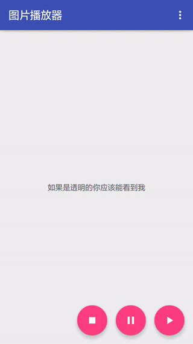

# PicturePlayerView

PicturePlayerView是基于TextureView的一个图片播放器，适用于播放多张图片组成的动画的场景。

**[文章地址](http://www.jianshu.com/p/53f9bd1fa1a6)**

## 效果

图片素材我使用的是[lottie-android](https://github.com/airbnb/lottie-android)的Logo

## 引用

Gradle

    compile 'com.xiuyukeji.pictureplayerview:pictureplayerview:0.1.1'
    
Maven

    <dependency>
      <groupId>com.xiuyukeji.pictureplayerview</groupId>
      <artifactId>pictureplayerview</artifactId>
      <version>0.1.1</version>
      <type>pom</type>
    </dependency>

## 使用

首先添加至XML

    <com.xiuyukeji.pictureplayerview.PicturePlayerView
        android:id="@+id/player"
        android:layout_width="match_parent"
        android:layout_height="match_parent"
        app:picture_opaque="false"
        app:picture_source="assets" />

然后在代码中设置数据源

    mPicturePlayerView.setDataSource("图片地址集合", "播放总时长");

最后调用start播放

    mPicturePlayerView.start();

## 方法说明

| 方法名 | 参数说明 | 备注
| --- | --- | ---
| setDataSource(String, String[], long) | (片文件夹地址, 图片名称数组, 播放总时长) | 设置数据源
| setDataSource(String, long) | (图片地址集合, 播放总时长) | 设置数据源
| start(void) | (无参数) | 开始播放
| resume(void) | (无参数) | 恢复播放
| pause(void) | (无参数) | 暂停播放
| stop(void) | (无参数) | 停止播放
| setScaleType(int) | ([FIT_WIDTH, FIT_HEIGHT, FIT_CENTER, FIT_CROP]) | 设置缩放类型
| setLoop(boolean) | (是否循环) | 设置是否循环播放
| setEnabled(boolean) | (是否有效) | 设置是否能开始播放
| setOnUpdateListener(OnUpdateListener) | (更新接口) | 每播放一帧都将回调
| | setOnStopListener(OnStopListener) | (停止接口) | 停止播放时回调
| setOnErrorListener(OnErrorListener) | (错误接口) | 播放出错时回调
| setOnChangeListener(OnChangeListener) | (改变接口) | TextureView的生命周期，创建和销毁
| boolan isLoop() | return 是否循环 | 是否循环播放
| boolan isEnabled() | return 是否有效 | 是否能开始播放
| boolan isPaused() | return 是否暂停 | 是否暂停播放
| boolan isPlaying() | return 是否播放中 | 是否播放中

## 属性说明

| 属性名 | 参数说明 | 备注
| --- | --- | ---
| picture_loop | boolean | 设置是否循环播放
| picture_opaque | boolean | 设置背景是否不透明
| picture_antiAlias | boolean | 设置是否开启抗锯齿
| picture_source | file, assets | 设置图片来源，目前一个View只支持一种来源
| picture_scaleType | fitWidth, fitHeight, fitCenter, fitCrop | 设置缩放类型
| picture_cacheFrameNumber | integer | 设置缓存数量，默认12帧

**如果它有解决你的问题的话，请star下，谢谢。**
